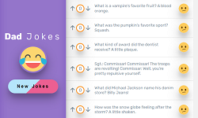

# Dad Jokes - React App

### Purpose
"Dad Jokes" is a delightful web application that utilizes the Axios library to pull random jokes from the "icanhazdadjoke" API. This interactive and entertaining app provides users with a collection of hilarious and family-friendly jokes for a good laugh.

The web app can be visited at [https://baljeet.ca/](https://baljeet.ca/)

### Component Hierarchy
* App
  * Homepage
    * components/Spinner
    * components/Sidebar
    * components/JokesList
      * Joke
        * Votes
        * Emoji

